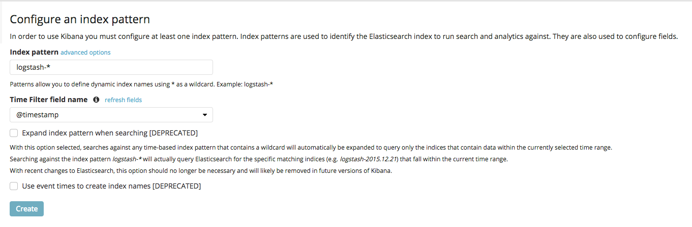
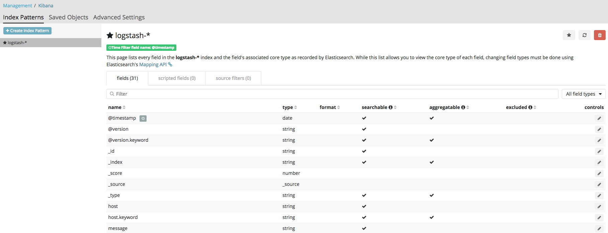
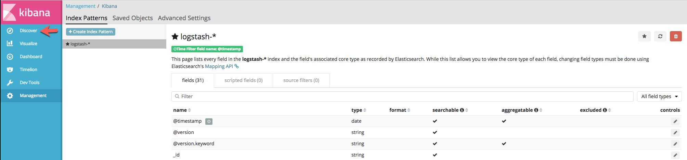
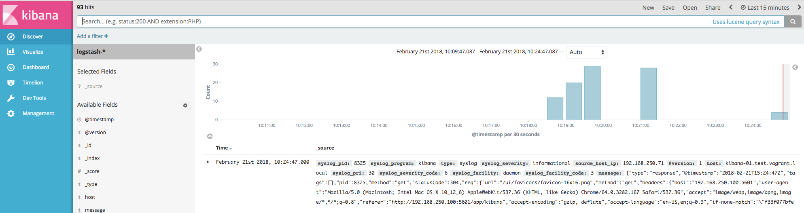
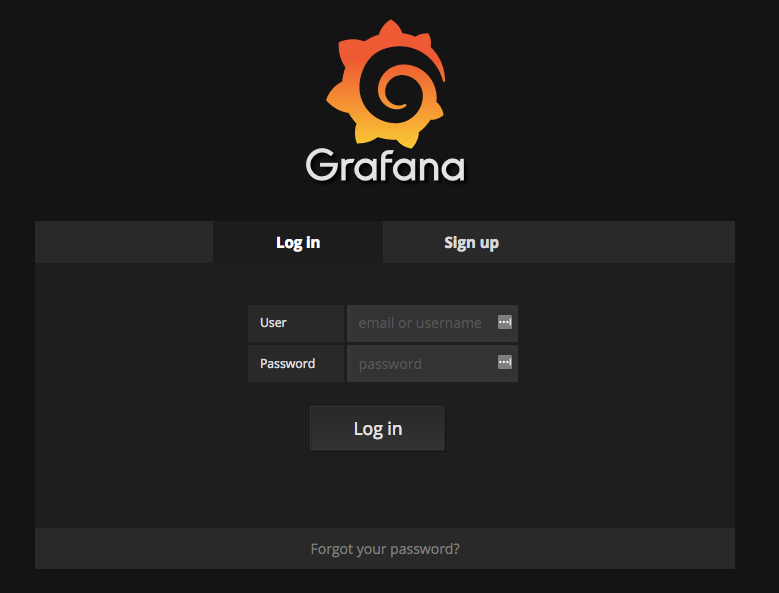
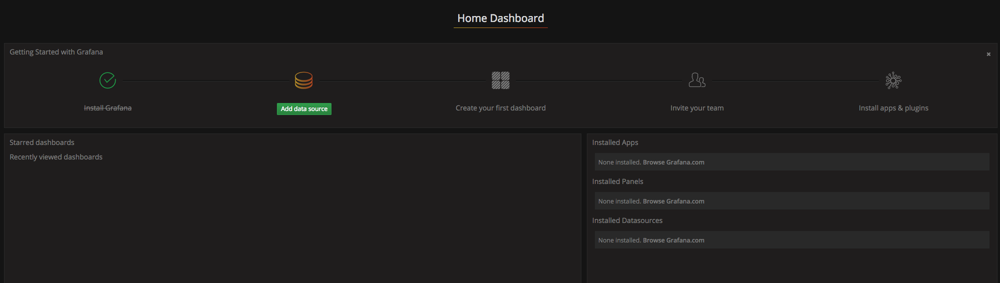
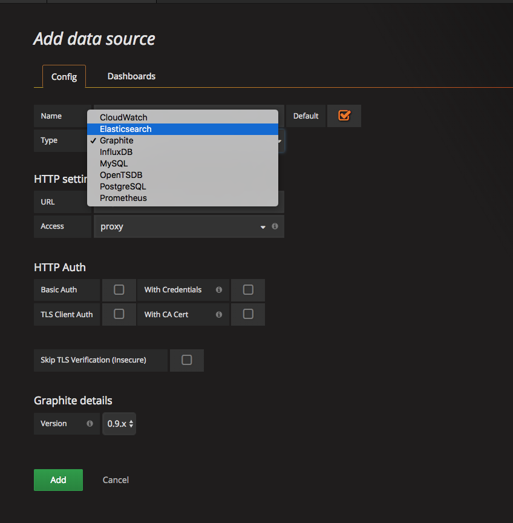
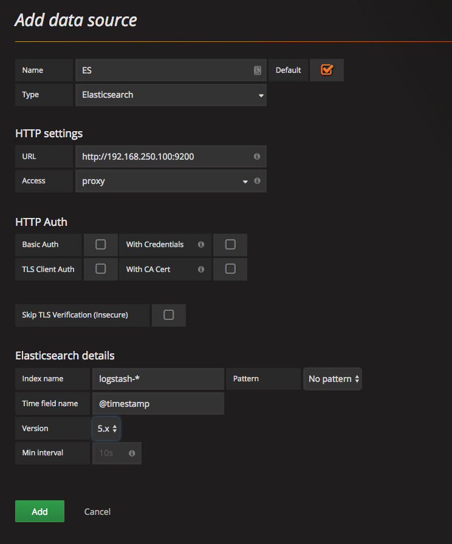
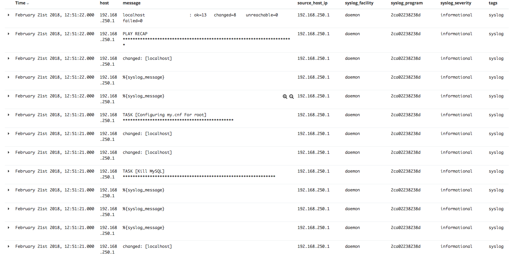

<!-- START doctoc generated TOC please keep comment here to allow auto update -->
<!-- DON'T EDIT THIS SECTION, INSTEAD RE-RUN doctoc TO UPDATE -->
**Table of Contents**  *generated with [DocToc](https://github.com/thlorenz/doctoc)*

- [Purpose](#purpose)
- [Requirements](#requirements)
  - [Software](#software)
- [Environment](#environment)
  - [Example Ansible inventory which is generated when Spinning Up](#example-ansible-inventory-which-is-generated-when-spinning-up)
- [Quick How-To](#quick-how-to)
  - [Spinning Up](#spinning-up)
  - [Kibana](#kibana)
  - [Grafana](#grafana)
  - [Tearing Down](#tearing-down)
- [Testing](#testing)

<!-- END doctoc generated TOC please keep comment here to allow auto update -->

## Purpose

Spin up a usable ELK Stack deployment within Vagrant for learning and POC's.

## Requirements

### Software

-   [Ansible](https://www.ansible.com)
-   [Vagrant](https://www.vagrantup.com)
-   [Virtualbox](https://www.virtualbox.org)

## Environment

> NOTE: The default deployment here is based on `Ubuntu 16.04`.

Adjusting VMs to spin up are defined in [nodes.yml](nodes.yml). You may also
want to checkout [customizing-environment](https://github.com/mrlesmithjr/vagrant-box-templates#customizing-environment).

For ease of defining your environment you can now adjust the variables defined
in the Ansible playbook [generate_environment.yml](generate_environment.yml).
And then execute the following to generate the required [nodes.yml](nodes.yml)
and [group_vars/all/all.yml](group_vars/all/all.yml):

```bash
ansible-playbook generate_environment.yml
```

### Example Ansible inventory which is generated when [Spinning Up](#spinning-up)

```bash
# Generated by Vagrant

broker-01 ansible_host=127.0.0.1 ansible_port=2201 ansible_user='vagrant' ansible_ssh_private_key_file='/Users/larry/Git_Projects/Personal/GitHub/mrlesmithjr/vagrant-ansible-elkstack/.vagrant/machines/broker-01/virtualbox/private_key'
broker-02 ansible_host=127.0.0.1 ansible_port=2202 ansible_user='vagrant' ansible_ssh_private_key_file='/Users/larry/Git_Projects/Personal/GitHub/mrlesmithjr/vagrant-ansible-elkstack/.vagrant/machines/broker-02/virtualbox/private_key'
broker-03 ansible_host=127.0.0.1 ansible_port=2203 ansible_user='vagrant' ansible_ssh_private_key_file='/Users/larry/Git_Projects/Personal/GitHub/mrlesmithjr/vagrant-ansible-elkstack/.vagrant/machines/broker-03/virtualbox/private_key'
dashboard-01 ansible_host=127.0.0.1 ansible_port=2209 ansible_user='vagrant' ansible_ssh_private_key_file='/Users/larry/Git_Projects/Personal/GitHub/mrlesmithjr/vagrant-ansible-elkstack/.vagrant/machines/dashboard-01/virtualbox/private_key'
es-01 ansible_host=127.0.0.1 ansible_port=2206 ansible_user='vagrant' ansible_ssh_private_key_file='/Users/larry/Git_Projects/Personal/GitHub/mrlesmithjr/vagrant-ansible-elkstack/.vagrant/machines/es-01/virtualbox/private_key'
es-02 ansible_host=127.0.0.1 ansible_port=2207 ansible_user='vagrant' ansible_ssh_private_key_file='/Users/larry/Git_Projects/Personal/GitHub/mrlesmithjr/vagrant-ansible-elkstack/.vagrant/machines/es-02/virtualbox/private_key'
es-03 ansible_host=127.0.0.1 ansible_port=2208 ansible_user='vagrant' ansible_ssh_private_key_file='/Users/larry/Git_Projects/Personal/GitHub/mrlesmithjr/vagrant-ansible-elkstack/.vagrant/machines/es-03/virtualbox/private_key'
lb-01 ansible_host=127.0.0.1 ansible_port=2222 ansible_user='vagrant' ansible_ssh_private_key_file='/Users/larry/Git_Projects/Personal/GitHub/mrlesmithjr/vagrant-ansible-elkstack/.vagrant/machines/lb-01/virtualbox/private_key'
lb-02 ansible_host=127.0.0.1 ansible_port=2200 ansible_user='vagrant' ansible_ssh_private_key_file='/Users/larry/Git_Projects/Personal/GitHub/mrlesmithjr/vagrant-ansible-elkstack/.vagrant/machines/lb-02/virtualbox/private_key'
pre-processor-01 ansible_host=127.0.0.1 ansible_port=2204 ansible_user='vagrant' ansible_ssh_private_key_file='/Users/larry/Git_Projects/Personal/GitHub/mrlesmithjr/vagrant-ansible-elkstack/.vagrant/machines/pre-processor-01/virtualbox/private_key'
processor-01 ansible_host=127.0.0.1 ansible_port=2205 ansible_user='vagrant' ansible_ssh_private_key_file='/Users/larry/Git_Projects/Personal/GitHub/mrlesmithjr/vagrant-ansible-elkstack/.vagrant/machines/processor-01/virtualbox/private_key'

[elkstack]
lb-01
lb-02
broker-01
broker-02
broker-03
pre-processor-01
processor-01
es-01
es-02
es-03
dashboard-01

[loadbalancers]
lb-01
lb-02

[brokers]
broker-01
broker-02
broker-03

[pre_processors]
pre-processor-01

[processors]
processor-01

[elasticsearch]
es-01
es-02
es-03

[dashboard]
dashboard-01
```

## Quick How-To

### Spinning Up

```bash
git clone https://github.com/mrlesmithjr/vagrant-ansible-elkstack.git
cd vagrant-ansible-elkstack
vagrant up
```

### Kibana

Once everything has been spun up you can connect to the [Kibana WebUI](http://192.168.250.100:5601)
and setup the index pattern as seen in the screenshot below:



After clicking `Create` you will now see:



And you are now ready to begin exploring some events, so click `Discover`



And now you should see some events:



### Grafana

Grafana is also part of the stack for additional visualization.

You can connect to the [Grafana WebUI](http://192.168.250.100:3000). And you will
be presented with the following login screen:



Login using `admin:admin` which is the default login account. Once logged in for
the first time you should be presented with the following screen to `Add data source`:



Click `Add data source` and select `Elasticsearch` from the dropdown:



Now fill out the details as in the example below:



Once all of the details have been filled out as above click `Add`:


### Tearing Down

When you are done tear it all down easily...

```bash
./scripts/cleanup.sh
```

## Testing

For some testing to ensure that you can get a good sample of different log types
you can spin up the included Docker Wordpress stack. The logging driver within
the `docker-compose.yml` has been defined as below:

```yaml
logging:
  driver: syslog
  options:
    syslog-address: "tcp://192.168.250.100"
```

To spin the stack up you need to ensure that you have Docker installed and functional
on your workstation. So to spin it up just do the following:

```bash
cd tests/docker-ansible-wordpress
docker-compose up
```

And you should see the following:

```bash
db_1         | WARNING: no logs are available with the 'syslog' log driver
wordpress_1  | WARNING: no logs are available with the 'syslog' log driver
```

Now head over to your [Kibana WebUI](http://192.168.250.100:5601) and you should
see events such as below:


